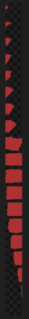

# <p align="center">ScreenEffects by Trplnr</p>
> <p align="center">A small flexible library for showing animated screen overlays to the user.</p>

### <p align="center">Download the datapack and resource pack!</p>

<p align="center">
    <a href="https://modrinth.com/datapack/screeneffects">
        
    </a>
    <a href="https://smithed.net/packs/screen-effects">
        
    </a>
</p>

## <p align="center">Demo</p>
> This is a YouTube video, click to play.

[](https://youtu.be/J5cWNG-nL1w)

## <p align="center">Usage</p>
### Making Screen Effects using the builder Deno file:

> [!IMPORTANT]
> Using this method requires the following to be installed in your system: [Deno](https://deno.land/), [ffmpeg](https://ffmpeg.org/). After getting those, restart your computer.

A screen effect is composed of multiple font frames that the datapack uses to show the animation.

A **utility Deno JS file is provided** with the resource pack inside the `screen_effects` folder to make this process easier.

#### 1. Making the animation
> [!NOTE]
> - You can use any image editing software you like as long as it can **export your animation into a spritesheet**. [Aseprite](https://www.aseprite.org/) has this functionality.
> - It is recommended to make a **256x256 .png file** for the best results.
- Start by creating an animation.


<br>

- Export your animation into a **vertical** spritesheet inside the `screen_effects` folder.

<br>



<br>

- You can add more spritesheets inside the `screen_effects` folder if you want more screen effects.

#### 2. Building the animations
- To prepare for building the animations, go inside the `buildScreenEffects.js` folder and adjust these configs.
```js
// -------------CONFIGS---------------
// Replace with the namespace you use!
const NAMESPACE = "example";

// This logs what the builder is currently doing.
// If compiling is taking a while, disabling this will improve compilation time.
const debugMode = false;

// If you want the font JSON files to be formatted, make this boolean true.
const prettyPrintFontFiles = false;

// If you want to see the ffmpeg logs, make this boolean true.
// If compiling is taking a while, disabling this will improve compilation time.
const showFFMPEGLogs = false;
// -----------------------------------
```
- To make your amazing animations usable by the datapack, You can run a command in your terminal to convert your spritesheets into frames!
- Open your preferred terminal and **make sure you are inside the `screen_effects` folder**.
- After that, run this command 
```sh
deno run --allow-all .\buildScreenEffects.js
```


- After running that, if everything is successful, it should look like this:


- Congrats! You've successfully turned your wonderful animations into frames! :tada:

- If you only want to to compile 1 spritesheet, simply run 
```sh
deno run --allow-all .\buildScreenEffects.js filename.png
```
---
### Registering the Screen Effects

The datapack needs to have data to know what a screen effect is so you have to register it.

Here is an example on how you can register one.

> ScreenEffect schema shown below this section.
```mcfunction
# To add your own screen effects to the global registry,
# simply copy what is shown here.
 
data modify storage example:scrfx_data screen_effects set value [ \
    { \
        name: "examples:toast", \
        tps: 1, \
        frame_count: 31, \
        path: "example:scrfx/exampletoast" \
    }, \
    { \
        name: "examples:transition", \
        tps: 1, \
        frame_count: 69, \
        path: "example:scrfx/exampletransition", \
        callbacks: { \
            "26": "say This frame covers the whole screen" \
        } \
    }, \
]

function scrfx:api/register_screen_effect/register_group {storage: "example:scrfx_data", path: "screen_effects"}
```

### The ScreenEffect Schema

This is the definition of a ScreenEffect.

```ts
[ // A screen effect group is just a list of screen effect definitions.
    {
        /**
        * The name of the screen effect, 
        * preferrably namespaced.
        */
        name: <resource_location>,
        /**
         * How fast each frame 
         * shows up measured in ticks.
         * 
         * Just like fps but well in ticks.
         * 
         * Must be above zero.
         */
        tps: <int>,

        /**
         * How many frames are in the animation.
         */
        frame_count: <int>,

        /**
         * The font resource location 
         * of the animation with the 
         * number at the end removed.
         */
        path: <resource_location>,
        /**
         * Defines what commands run in a certain frame.
         * 
         * Optional.
         */
        callbacks?: {
            "<frame_number>": "<command>",
            ...
        }
    }
]
```

### Running the Screen Effects
- Declare the animation to be played inside the `scrfx:in id` storage.
- Then execute as a player and run `scrfx:play`!

> Example:
```mcfunction
data modify storage scrfx:in id set value "ns:identifier"
execute as Trplnr run function scrfx:play
```

- You have successfully played a screen effect! :tada: